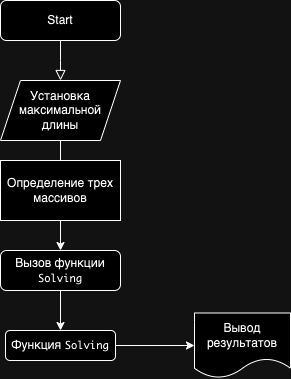

# Описание решения

## 🖥️ Описание Фрагмента Кода

Данный фрагмент кода на языке C# демонстрирует программу, которая фильтрует массивы строк в зависимости от длины их элементов. В нем определены следующие функции:

- **CountItems**: Подсчитывает количество элементов в массиве, длина которых меньше или равна заданной максимальной длине.
- **NewArray**: Создает новый массив, содержащий только элементы из исходного массива, удовлетворяющие критериям длины.
- **PrintArray**: Выводит содержимое массива на консоль в форматированном виде.
- **Solving**: Выполняет процесс фильтрации для входного массива, выводя как исходный, так и отфильтрованный массивы.

### Использование

Для использования этого фрагмента кода:

1. Вызовите функцию `Solving` с массивом строк и максимальным критерием длины.
2. Программа выведет исходный массив, за которым следует символ стрелки (`→`), и отфильтрованный массив, содержащий только элементы, удовлетворяющие критериям длины.

### Пример

```csharp
System.Console.Clear(); 
int max = 3;     
string[] array1 = { "05", "214", "Armenia", ":-), afr2, 122, 23" };
Solving(array1, max);
string[] array2 = { "5065", "-32", "123, an, Pash, 34" };
Solving(array2, max);
string[] array3 = { "a2321", "32", "hf, 932, 2003" };
Solving(array3, max);

